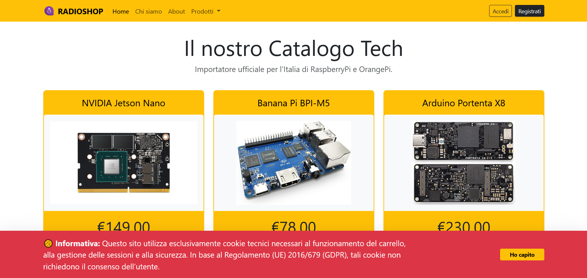

# 🛒 radioshop - Progetto E-commerce MVC

**ITIS C. Zuccante** - Esercitazione pratica per la creazione di un'applicazione web e-commerce in linguaggio **PHP**, implementata secondo il pattern architetturale **MVC** (Model-View-Controller).

Questa è un'applicazione web professionale che sfrutta l'architettura a livelli per separare la logica di business dalla presentazione, garantendo scalabilità e manutenibilità del software.

## 📚 Documentazione del Progetto

### 🏗️ Struttura del Progetto
Per una visione dettagliata dell'architettura del software e delle convenzioni di denominazione utilizzate (PascalCase per le classi, camelCase per i metodi), consulta il seguente documento:

* 📂 [Struttura del Progetto e Convenzioni](doc/main_structure.md)
* 📊 [Diagramma Entità-Relazione (ERD)](doc/ERD.md)

## 🛠️ Stack Tecnologico

*   **Linguaggio:** PHP 8.x
*   **Database:** MySQL tramite estensione PDO (con l'uso di **Prepared Statements** per la protezione da SQL Injection)
*   **Architettura:** MVC (Model-View-Controller) per il disaccoppiamento dei componenti
*   **Frontend:** HTML5, CSS3, Bootstrap 5.3.x per un'interfaccia responsive

### 🎓 Nota per il Laboratorio (TPSIT)
Il progetto è stato sviluppato ponendo particolare attenzione ai seguenti aspetti della materia:
*   **Sicurezza Applicativa:** Sanitizzazione degli input e gestione sicura delle sessioni utente.
*   **Architettura Web:** Gestione corretta delle richieste HTTP tramite un Front Controller (`index.php`).
*   **Astrazione dei Dati:** Utilizzo di un **Persistence Layer** dedicato per l'interazione con il DBMS.

## 📜 Storico Modifiche

[Documento storico delle revisioni e debugging](doc/history.md)

---

### 📐 Progettazione Database

---

### 📸 Anteprima Interfaccia

---
