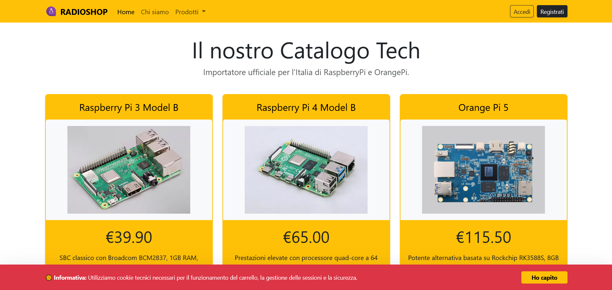
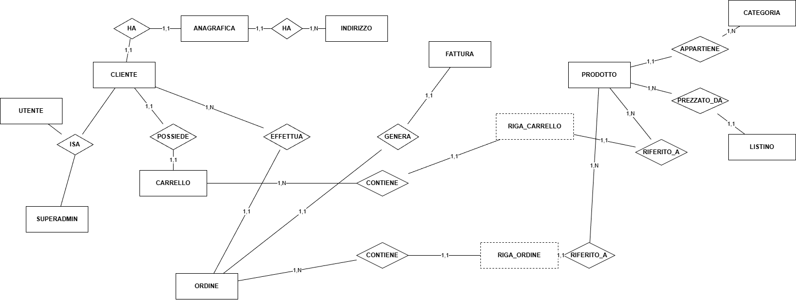
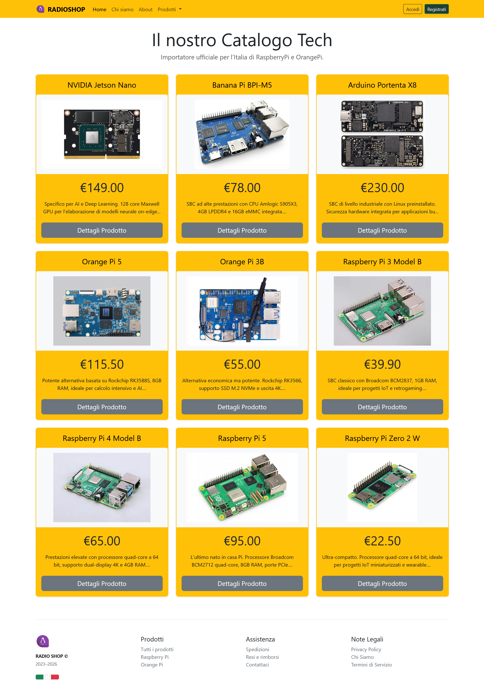

# radioshop - E-commerce MVC Project

ITIS C. Zuccante - Esercizio di creazione di un sito web e-commerce in linguaggio PHP ed usando il pattern MVC.

This is a professional E-commerce web application built with PHP following the MVC (Model-View-Controller) design pattern.

## Project Documentation

# Project Structure
For a detailed view of the project's architecture and file organization, please refer to the following document:

* 📂 [Project Structure and Naming Conventions](doc/main_structure.md)
* 📊 [Entity-Relationship Diagram (ERD)](doc/ERD.md)

## Tech Stack

* **Language:** PHP 8.x
* **Database:** MySQL via PDO (with Prepared Statements)
* **Architecture:** MVC (Model-View-Controller)
* **Frontend:** HTML5, CSS3, Bootstrap 5.3.x

---

---

