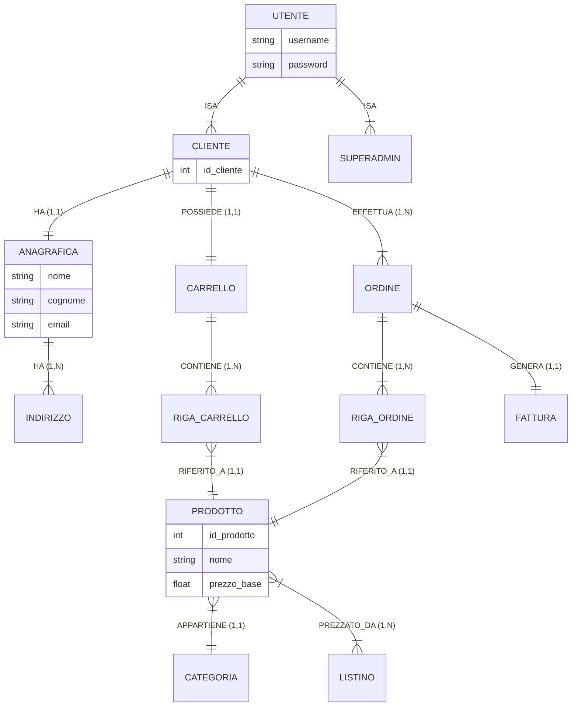

```mermaid
erDiagram
    %% Gerarchia Utente
    UTENTE ||--|{ CLIENTE : "ISA"
    UTENTE ||--|{ SUPERADMIN : "ISA"

    %% Relazioni Anagrafica e Indirizzo
    CLIENTE ||--|| ANAGRAFICA : "HA (1,1)"
    ANAGRAFICA ||--|{ INDIRIZZO : "HA (1,N)"

    %% Processo d'Acquisto
    CLIENTE ||--|| CARRELLO : "POSSIEDE (1,1)"
    CLIENTE ||--|{ ORDINE : "EFFETTUA (1,N)"
    
    %% Composizione Carrello e Ordine
    CARRELLO ||--|{ RIGA_CARRELLO : "CONTIENE (1,N)"
    ORDINE ||--|{ RIGA_ORDINE : "CONTIENE (1,N)"
    
    %% Fatturazione
    ORDINE ||--|| FATTURA : "GENERA (1,1)"

    %% Relazioni con Prodotto
    RIGA_CARRELLO }|--|| PRODOTTO : "RIFERITO_A (1,1)"
    RIGA_ORDINE }|--|| PRODOTTO : "RIFERITO_A (1,1)"
    
    %% Catalogo e Listini
    PRODOTTO }|--|| CATEGORIA : "APPARTIENE (1,1)"
    PRODOTTO }|--|{ LISTINO : "PREZZATO_DA (1,N)"

    UTENTE {
        string username
        string password
    }

    CLIENTE {
        int id_cliente
    }

    ANAGRAFICA {
        string nome
        string cognome
        string email
    }

    PRODOTTO {
        int id_prodotto
        string nome
        float prezzo_base
    }
```