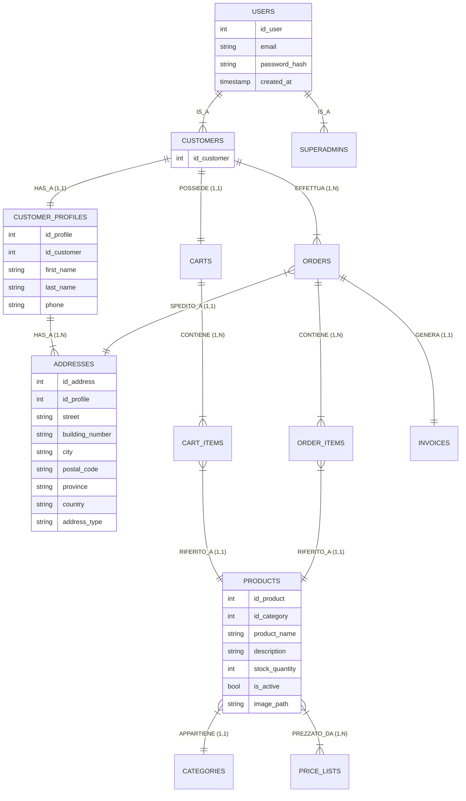

```mermaid
erDiagram
    %% Gerarchia Utente
    USERS ||--|{ CUSTOMERS : "IS_A"
    USERS ||--|{ SUPERADMINS : "IS_A"

    %% Relazioni Anagrafica (CUSTOMER_PROFILES) e Indirizzo (ADDRESSES)
    CUSTOMERS ||--|| CUSTOMER_PROFILES : "HAS_A (1,1)"
    CUSTOMER_PROFILES ||--|{ ADDRESSES : "HAS_A (1,N)"

    %% Processo d'Acquisto
    CUSTOMERS ||--|| CARTS : "POSSIEDE (1,1)"
    CUSTOMERS ||--|{ ORDERS : "EFFETTUA (1,N)"
    
    %% Composizione CARTS e ORDERS
    CARTS ||--|{ CART_ITEMS: "CONTIENE (1,N)"
    ORDERS ||--|{ ORDER_ITEMS : "CONTIENE (1,N)"
    
    %% Fatturazione
    ORDERS ||--|| INVOICES : "GENERA (1,1)"

    %% Relazioni con PRODUCTS
    CART_ITEMS }|--|| PRODUCTS : "RIFERITO_A (1,1)"
    ORDER_ITEMS }|--|| PRODUCTS : "RIFERITO_A (1,1)"
    
    %% Catalogo e Listini
    PRODUCTS }|--|| CATEGORIES : "APPARTIENE (1,1)"
    PRODUCTS }|--|{ PRICE_LISTS : "PREZZATO_DA (1,N)"

    ORDERS }|--|| ADDRESSES : "SPEDITO_A (1,1)"
    
   USERS {
    int id_user
    string email
    string password_hash
    timestamp created_at
    }

    CUSTOMERS {
        int id_customer
    }

    CUSTOMER_PROFILES {
    int id_profile
    int id_customer
    string first_name
    string last_name
    string phone
}

 PRODUCTS {
    int id_product
    int id_category
    string product_name
    string description
    int stock_quantity
    bool is_active
    string image_path
}

    ADDRESSES {
    int id_address
    int id_profile
    string street
    string building_number
    string city
    string postal_code
    string province
    string country
    string address_type
}
```