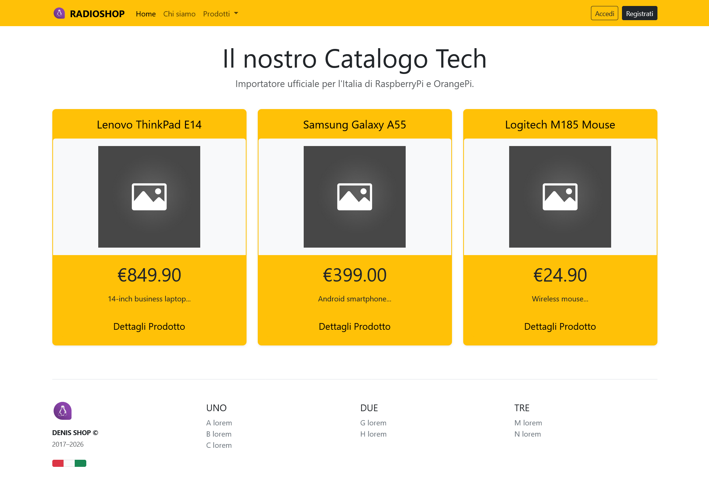
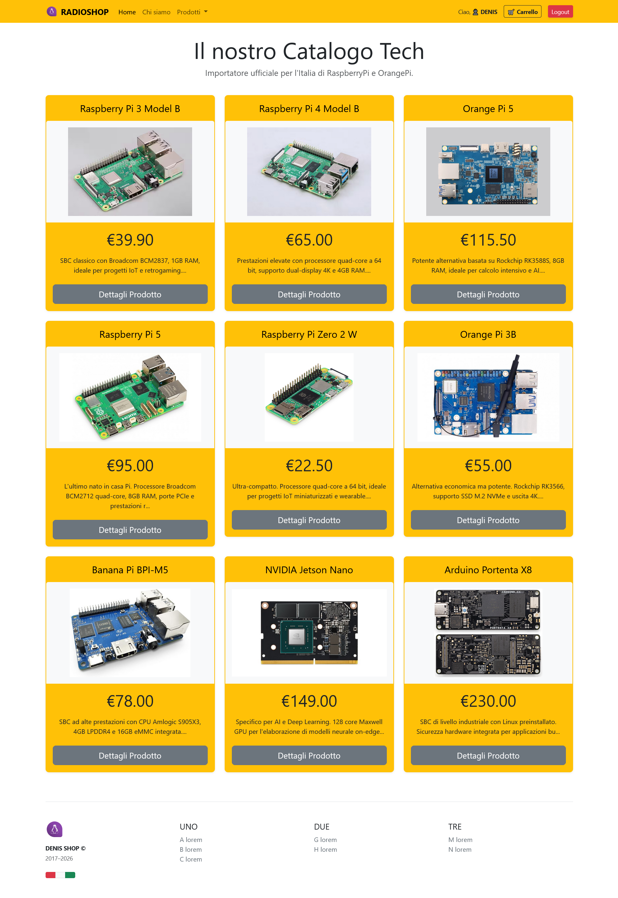

# 📜 Cronologia dello Sviluppo - RADIOSHOP
**Materia:** Tecnologie e Progettazione di Sistemi Informatici e Telecomunicazioni (TPSIT)  
**Ambiente:** Lab B16 - I.T.I.S. Carlo Zuccante  
**Obiettivo:** Documentazione dell'evoluzione dell'interfaccia e della logica distribuita.

---

## 🚀 Evoluzione del Progetto
In questa sezione viene documentata l'evoluzione del frontend e l'integrazione con il backend PHP/MySQL, evidenziando il passaggio da dati statici a dati dinamici estratti dal database.

### 1. Prima Bozza del Catalogo
Inizialmente il catalogo mostrava i prodotti con dati di test. Il sistema di routing non era ancora allineato con i parametri della navbar.

### 2. Integrazione Backend e Debugging Query
Dopo aver allineato il Controller con il parametro `type`, abbiamo risolto i problemi di filtraggio SQL. In questa fase sono stati gestiti i primi reindirizzamenti "fail-safe" verso la pagina di manutenzione.

### 3. Visualizzazione Asset Statici e Fix Mapping
Risoluzione degli errori di tipo `Undefined array key`. In questa fase è stato implementato il caricamento dinamico delle immagini dalla directory `public/images/products/`.

### 4. Ottimizzazione Layout e Uniformità Card
Implementazione finale del sistema **Flexbox** di Bootstrap per garantire che tutte le card abbiano la stessa altezza (`h-100`). Troncamento delle stringhe lato server per mantenere la consistenza della UI.

---

## 🛠️ Note Tecniche (TPSIT)
*   **Architettura:** MVC (Model-View-Controller).
*   **Persistence Layer:** Database relazionale MySQL con gestione delle validità temporali (`CURDATE()`).
*   **Sicurezza:** Utilizzo di Prepared Statements per la protezione contro SQL Injection.
*   **UI/UX:** Design responsive basato su Bootstrap 5.